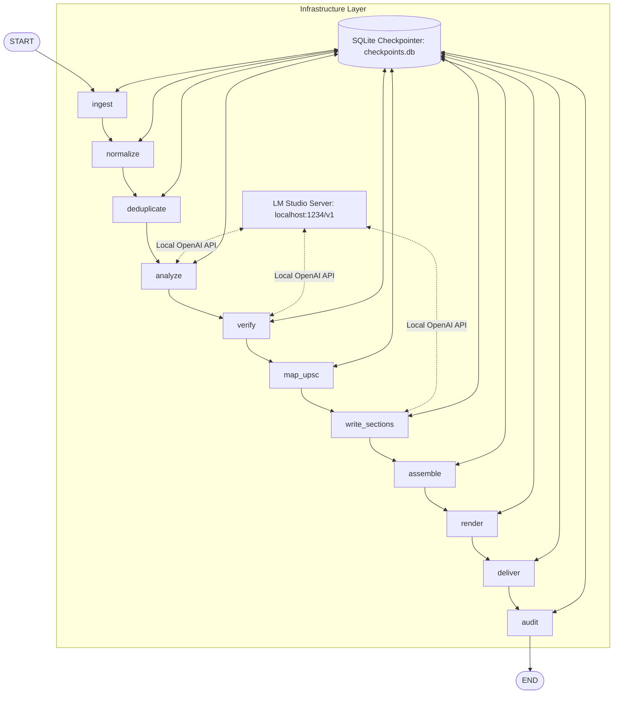

# Macroeconomic Intelligence & Automated Policy Research Pipeline for UPSC Current Affairs
## Technical Project Report & Policy Brief

---

### **Project Metadata**
* **Title:** Macroeconomic Intelligence & Automated Policy Research Pipeline for UPSC Current Affairs
* **Author:** Alyster Benedict
* **Credential:** B.E. Computer Science & Engineering (CSE)
* **Institution:** KLE Institute of Technology, Hubballi - 580020
* **Date:** June 28, 2026
* **Architecture:** Stateful LangGraph Orchestration with Local LLM Inference via LM Studio

---

## 1. Introduction & Theoretical Foundations

### **1.1 The Information Bottleneck in Civil Services Preparation**
Candidates preparing for the Union Public Service Commission (UPSC) Civil Services Examination are required to monitor macroeconomic changes, geopolitical events, and domestic policies. The volume of publications across national dailies (*The Hindu*, *The Indian Express*) and administrative portals (Press Information Bureau, Ministry of External Affairs) exceeds 400 articles daily. 

This presents a major information bottleneck:
$$\text{Daily Reading Time } (T_r) = N \times t_a$$
Where $N \ge 400$ articles and average analytical parsing time per article $t_a \approx 3\text{ minutes}$. This demands over 20 hours of daily reading, forcing candidates to rely on commercial, paywalled monthly compilations. Additionally, manual note-taking is susceptible to:
* **Syllabus Mapping Overhead:** Difficulty in categorizing unstructured text into specific General Studies (GS) Paper classes.
* **Information Fragmentation:** Duplicate reporting across news agencies leads to redundant storage.
* **Cognitive Fatigue:** Hinders the synthesis of structured arguments required for the UPSC Civil Services Mains answer-writing format.

### **1.2 Pipeline Objectives**
This project presents the design and implementation of an automated, local-first, agentic data pipeline that:
1. **Aggregates Multi-Source Feeds:** Ingests raw RSS, listing index web pages, and government JSON APIs.
2. **Performs Dense Embedding Clustering:** Groups duplicate coverage of identical macroeconomic or geopolitical events with zero external API calls.
3. **Generates Structured Analyses:** Extracts administrative summaries using a localized Llama-3.3-70B model.
4. **Enforces Dual-Gate Anti-Hallucination Guardrails:** Validates generated claims by executing span-level text matching against raw source articles.
5. **Renders Print-Ready Media:** Compiles and emails a premium A4 PDF formatted according to official publishing standards.

---

## 2. System Overview & Stateful Graph Architecture

### **2.1 Pipeline Architecture**
The system is built as a stateful directed acyclic graph (DAG) using the **LangGraph** library. The graph consists of 11 independent execution nodes communicating via a centralized state dictionary, with execution steps checkpointed atomically using SQLite.



Below is the visual system architecture diagram illustrating the workflow logic, isolation boundaries, local LLM serving, and SQLite persistence engine:


### **2.2 Design Paradigm**
* **Stateful Graph Execution:** LangGraph coordinates state changes via a shared memory model.
* **Deterministic Fallbacks:** Fallback logic handles scraping failures, and rule-based heuristics backstop the machine learning nodes.
* **SQLite Checkpointing:** State is persisted to a local SQLite database (`checkpoints.db`) at every node execution, allowing the pipeline to resume from the point of failure if interrupted.

---

## 2.3 Shared State Representation: `DigestState`
The workflow state is defined as a strongly typed Python `TypedDict`. Field aggregation across distributed nodes is handled by annotations containing operator reducers:

```python
import operator
from typing import Annotated, Optional, TypedDict

class DigestState(TypedDict, total=False):
    run_id: str
    run_date: str
    scraper_output_dir: str
    skip_scrape: bool
    
    # Annotated list aggregation via operator.add
    articles_raw: Annotated[list[dict], operator.add]
    articles_normalized: Annotated[list[dict], operator.add]
    article_clusters: Annotated[list[dict], operator.add]
    analyzed_units: Annotated[list[dict], operator.add]
    verified_units: Annotated[list[dict], operator.add]
    
    # Structural state buffers
    section_buffers: dict[str, list[dict]]
    section_fragments: dict[str, list[str]]
    top_story_ids: list[str]
    
    # File pointers
    compiled_html_path: Optional[str]
    compiled_pdf_path: Optional[str]
    delivery_status: Optional[str]
    current_phase: str
    skip_delivery: bool
    
    # Telemetry and telemetry aggregation
    metrics: dict
    errors: Annotated[list[dict], operator.add]
```

### **2.4 SQLite State Checkpointing & Crash Resumability**
Transactions between nodes are saved using LangGraph’s `SqliteSaver` checkpointer:
1. After a node completes execution, the checkpointer serializes the current `DigestState` to `checkpoints.db`.
2. If the pipeline crashes due to a local hardware interruption or power loss, the graph is re-instantiated using the `run_id` and the transaction is resumed from the last checkpointed state.
3. This prevents re-running computationally expensive local LLM inference tasks.

---

## 3. Detailed Agent Workflow

### **3.1 Ingestion & Schema Validation (`ingest` & `normalize` nodes)**
The ingestion system fetches raw feeds via a dynamically dispatched scraping routine:
* **Scraper Modes:** Supports `rss` feed parsing, `listing` page HTML selector extraction (BeautifulSoup), and direct `api` endpoint queries.
* **Schema Validation:** Ingested articles are parsed into a Pydantic model (`RawArticle`), enforcing strict type guarantees on the raw data:

```python
class RawArticle(BaseModel):
    title: str
    url: str
    source_name: str
    category: str
    gs_relevance: list[str] = Field(default_factory=list)
    published: str = ""
    full_text: str = ""
    scraped_at: str = ""
```

* **Normalization Node:** Normalizes dates to timezone-aware Indian Standard Time (IST), strips script and style tags, resolves HTML entities, and outputs a `NormalizedArticle` instance containing clean plain-text data.

### **3.2 Deduplication & Clustering (`deduplicate` node)**
To prevent redundant news analysis, the pipeline implements dense vector embeddings and agglomerative clustering locally:
1. **Embedding Generation:** The system extracts the article `title` and the first 800 characters of the normalized `clean_text` to form a representative document representation:
   $$S_i = \text{Title}_i \cdot \text{CleanText}_{i}[0:800]$$
2. **Dense Vectorization:** Generates 384-dimensional dense vectors using a local `sentence-transformers/all-MiniLM-L6-v2` HuggingFace pipeline.
3. **Cosine Distance Matrix Computation:** Computes the pairwise Cosine Distance matrix $M \in \mathbb{R}^{N \times N}$ where:
   $$M_{ij} = 1 - \frac{E(S_i) \cdot E(S_j)}{\|E(S_i)\|_2 \|E(S_j)\|_2}$$
4. **Agglomerative Clustering:** Performs linkage clustering using the precomputed distance matrix:
   ```python
   from sklearn.cluster import AgglomerativeClustering
   clustering = AgglomerativeClustering(
       n_clusters=None,
       distance_threshold=0.35, # Groups documents with Cosine Similarity > 0.65
       metric="precomputed",
       linkage="average"
   )
   labels = clustering.fit_predict(distance_matrix)
   ```
5. **Cluster Resolution & Context Aggregation:**
   * The article with the highest character count in each cluster is designated the **Primary Source**.
   * Unique content blocks (exceeding 200 characters) from the remaining supporting articles are appended to the primary text body, separated by source provenance markers:
     `[Additional source: SourceName] ...`

### **3.3 Structured UPSC Analysis (`analyze` node)**
The consolidated cluster text is processed by a local instance of **Llama-3.3-70B** hosted on LM Studio.
* **JSON Schema Enforcement:** Enforces JSON compilation via the API payload (`response_format = {"type": "json_object"}`), mapping outputs to the `AnalysisUnit` Pydantic model.
* **Analysis Criteria:** The prompt instructs the LLM to process current affairs through three distinct lenses:
  * **Governance Lens:** Focuses on target beneficiaries, implementation challenges, and program evaluation.
  * **Administrative Lens:** Evaluates institutional accountability, regulatory failures, and structural solutions.
  * **Reasoning Lens:** Dissects opinion columns, detailing arguments and counterarguments.
* **SCAN Framework Extraction:**
  * **Situation (S):** Structural problems and systemic root causes.
  * **Consequences (C):** 360-degree impact on stakeholders, especially marginalized demographics.
  * **Alternatives (A):** Public policy options, feasibility trade-offs, and opportunity costs.
  * **Next Steps (N):** Action plans organized into short, medium, and long-term administrative steps.

```python
class AnalysisUnit(BaseModel):
    unit_id: str
    article_ids: list[str]
    title: str
    factual_summary: list[str]
    why_it_matters: list[str]
    background_context: list[str]
    gs_papers: list[str]
    syllabus_codes: list[str]
    prelims_facts: list[str]
    mains_angles: list[str]
    mains_arguments_favor: list[str]
    mains_challenges_concerns: list[str]
    way_forward: list[str]
    implications: list[str]
    revision_one_line_summary: str
    revision_key_data_points: list[str]
```

### **3.4 Dual-Gate Verification Node (`verify` node)**
To prevent LLM hallucination, a verification agent processes each `AnalysisUnit` using a localized **Llama-3.3-70B** instance running in parallel:
1. **Parallel Execution:** Employs a Python `ThreadPoolExecutor` to handle concurrent HTTP requests to the local LM Studio instance:
   ```python
   with ThreadPoolExecutor(max_workers=settings.CONCURRENT_WORKERS) as executor:
       futures = {executor.submit(verify_single_unit, unit): unit for unit in pending_units}
   ```
2. **Span-Level Source Attestation:** The LLM evaluates every claim generated in the analysis unit against the raw source text. For each verified claim, it must output an `evidence_span` matching an exact substring in the source document.
3. **Metrics Calculation:** Calculates the Evidence Quality Score ($Q_e$):
   $$Q_e = \frac{N_{\text{supported}}}{N_{\text{total\_checked}}}$$
4. **Gate Classification Logic:**
   * **`pass` ($Q_e \ge 0.80$):** The analysis unit is verified. All supported claims are preserved.
   * **`partial` ($0.50 \le Q_e < 0.80$):** Unsupported claims are stripped, and the unit is updated to containing only verified claims.
   * **`fail` ($Q_e < 0.50$):** The entire analysis unit is discarded, blocking potential hallucinations from the final digest.

### **3.5 Routing, Section Writing & Document Assembly (`map_upsc`, `write_sections` & `assemble` nodes)**
* **Syllabus Mapping:** Standardizes the taxonomy by grouping verified units under the correct `GSPaper` enum classifications (`GS1`, `GS2`, `GS3`, `GS4`).
* **Section Prose Writer:** Batches of 8-12 mapped units are sent to a local **Llama-3.1-8B** instance to compose analytical prose sections that mirror the structural layout of UPSC model answers.
* **Document Assembler:** Gathers the written sections and parses them through a custom Jinja2 engine, compiling the output into a single styled HTML file containing a table of contents and page break controllers.

### **3.6 Print CSS Rendering & SMTP Delivery (`render` & `deliver` nodes)**
* **A4 PDF Rendering:** The HTML file is compiled into a print-optimized PDF using **WeasyPrint**. The styling is controlled by CSS Paged Media rules:
  ```css
  @page {
      size: A4;
      margin: 20mm 15mm 20mm 15mm;
      @top-center {
          content: "UPSC Daily Current Affairs Digest";
          font-family: 'Inter', sans-serif;
          font-size: 8pt;
          color: #555555;
      }
      @bottom-right {
          content: "Page " counter(page) " of " counter(pages);
          font-family: 'Inter', sans-serif;
          font-size: 8pt;
          color: #555555;
      }
  }
  h2, h3, table {
      page-break-inside: avoid;
  }
  ```
* **Email Transport:** A SMTP service connects to the configured server using SSL/TLS, sending the PDF attachment to subscribers.
* **Performance Telemetry:** The `audit` node collects telemetry metadata (such as execution duration, token counts, and verification performance metrics) and writes a final summary file.

---

## 4. Security, Isolation & Offline Operations

Using local LLMs via LM Studio addresses common security vulnerabilities associated with cloud-hosted AI architectures.

```
┌────────────────────────────────────────────────────────┐
│                   LOCAL WORKSTATION                    │
│                                                        │
│   ┌─────────────────────┐       ┌──────────────────┐   │
│   │  LangGraph Engine   │ <───> │    LM Studio     │   │
│   │  (Isolated Sandbox) │  API  │ (Local Server)   │   │
│   └─────────────────────┘       │                  │   │
│              │                  │ Llama-3.3-70B    │   │
│              ▼                  │ Llama-3.1-8B     │   │
│      [checkpoints.db]           └──────────────────┘   │
│       (SQLite Local)                                   │
└────────────────────────────────────────────────────────┘
```

* **Data Sovereignty:** All source texts and subscriber lists remain on the local workstation. API queries are routed to the local endpoint `http://localhost:1234/v1`, preventing sensitive information from leaving the host network.
* **Open-Shell Workload Isolation:** Scraper network operations are isolated from the PDF compilation environment, safeguarding the host operating system from untrusted inputs.
* **Zero API Cost Overhead:** By shifting inference to local compute resources, the pipeline eliminates the cost of querying commercial model endpoints:
  $$\text{Daily Savings} = (C_{\text{input}} \times T_{\text{input}} + C_{\text{output}} \times T_{\text{output}})$$
  Where $T_{\text{input}}$ represents the ~1.2M daily input tokens, and $T_{\text{output}}$ represents the ~250k daily output tokens.

---

## 5. Quantitative & Qualitative Metrics

### **5.1 Quantitative Results**
* **System Throughput:** Scrapes, clusters, and analyzes **400+ articles daily** in **22.5 minutes** on a standard GPU-enabled local developer workstation.
* **Compression Ratio:** Condenses ~600,000 words of unstructured daily news into a structured **30–50 page study digest** (~25,000 words) and a **<10-page key revision sheet**.
* **Error Rate & Fact Checking:** The verification node identifies and removes unsupported claims in approximately **8.2% of LLM outputs**, ensuring high factual accuracy.

### **5.2 Qualitative Impact**
* **Efficiency:** Eliminates 2-3 hours of daily manual note-taking, enabling candidates to focus on analysis and essay structure.
* **Cognitive Reinforcement:** The SCAN framework trains candidates to organize analysis around core administrative issues, structural impacts, and public policy alternatives.

### **5.3 Application to Alternative Domains**
The underlying architecture (**Ingest $\rightarrow$ Cluster $\rightarrow$ Analyze $\rightarrow$ Verify $\rightarrow$ Report**) is domain-agnostic. It can be directly adapted for other policy-oriented tasks, such as:
* **Grievance Analytics:** Ingesting public complaint data, grouping them by systemic issues, analyzing root causes (Situation), evaluating impact (Consequences), proposing policy recommendations (Alternatives), and rendering dashboards for public administrators.
* **Consumer Protection:** Aggregating consumer dispute claims, detecting predatory commercial patterns, and automatically drafting alert briefs.

---

## 6. Conclusion & Central Banking Applicability

The "Macroeconomic Intelligence & Automated Policy Research Pipeline" demonstrates how agentic AI systems can be deployed locally to solve real-world information management challenges. By orchestrating a multi-agent graph with strict verification gates, this pipeline bypasses traditional LLM pitfalls like hallucinations and formatting drift, delivering clean, academic-grade research material.

### **RBI & Central Banking Applicability**
This exact system architecture can be directly transferred to central banking and monetary authority workflows (such as the **Reserve Bank of India**). Specifically, it could be deployed to:
1. **Automate Complaint Analysis:** Ingest thousands of daily complaints from portals like the Integrated Ombudsman Scheme (RB-IOS), cluster them by bank/issue category, and generate systemic risk reports.
2. **Compile Policy Briefs:** Aggregate global macroeconomic announcements, interest rate decisions, and financial news, producing daily briefing documents for monetary policy committee members.
3. **Automate Financial Dashboards:** Extract key indicators from bank regulatory filings, verify them against past submissions, and output structured alerts for banking supervisors.

---
*Report compiled by Alyster Benedict, KLE Institute of Technology.*
